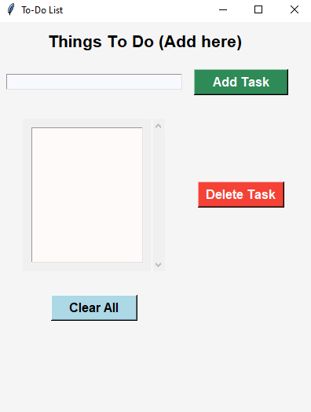

# ✅ SmartTask Manager - Tkinter

A clean and interactive *To-Do List (Task Manager)* application built using *Python Tkinter GUI*.  
Helps users stay productive by adding, completing, and deleting tasks with a simple and responsive interface.

---

## 🚀 Features

- ➕ Add new tasks
- ✅ Mark tasks as completed
- ❌ Delete individual tasks
- 🔄 Clear all tasks at once
- 🖱 Intuitive GUI 
- 💾 Save/load support

---

## 🖼 App Preview

